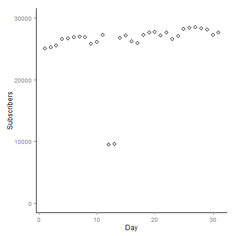

# 第4章笔记 Scatter Point Chart和Candel Stick Chart (flowingdata_subscribers)

**目录**

## 代码
 - 数据，[flowingdata_subscribers.csv](flowingdata_subscribers.csv)
 - 课本代码，[book.R](book.R)
 - 改编代码，[mine.R](mine.R)

## 课本内容简介
 - 绘制RSS订阅人数的Scatter Point Chart

课本代码plot | 改编代码 ggplot2
--------|--------
|

 - 绘制RSS订阅人数的Candel Stick Chart

课本代码plot+points | 改编代码 ggplot2
--------|--------
|

