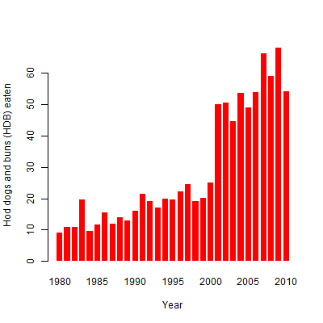
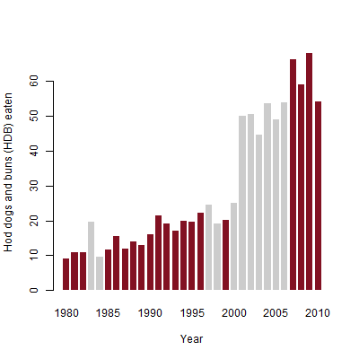
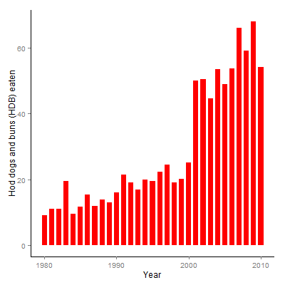
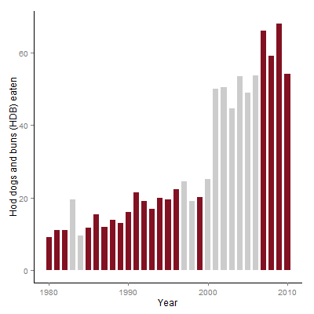

# 第4章笔记 Bar Chart (hot-dog-contest-winners)

**目录**
 - [代码](#%E4%BB%A3%E7%A0%81)
 - [课本内容简介](#%E8%AF%BE%E6%9C%AC%E5%86%85%E5%AE%B9%E7%AE%80%E4%BB%8B)
 - [笔记 - 用“向量化ifelse”替代“for + if/else”](#%E7%AC%94%E8%AE%B0---%E7%94%A8%E5%90%91%E9%87%8F%E5%8C%96ifelse%E6%9B%BF%E4%BB%A3for--ifelse)
 - [笔记 - 用ggplot2替代barplot](#%E7%AC%94%E8%AE%B0---%E7%94%A8ggplot2%E6%9B%BF%E4%BB%A3barplot)

## 代码
 - 数据，[hot-dog-contest-winners.csv](hot-dog-contest-winners.csv)
 - 课本代码，[book.R](book.R)
 - 改编代码，[mine.R](mine.R)

## 课本内容简介
 - 使用barplot来绘制bar chart
```R
    barplot(hotdogs$Dogs.eaten, names.arg=hotdogs$Year,
      col=fill_colors,
      xlab="Year", ylab="Hod dogs and buns (HDB) eaten",
      border=NA, space=0.3
      )
```

 - 两种填充颜色的方案

方案A: 所有bar填充相同颜色 | 方案B: 所有bar根据冠军是否是美国填充不同颜色
---------------------------|---------------------------------------------
 | 

## 笔记 - 用“向量化ifelse”替代“for + if/else”

为了生成方案B里不同颜色的向量，课本里使用大段的“for + if/else”
```R
      fill_colors <- c()
      for ( i in 1:length(hotdogs$Country) ) {
        if (hotdogs$Country[i] == "United States") {
          fill_colors <- c(fill_colors, "#821122")
        } else {
          fill_colors <- c(fill_colors, "#cccccc")
        }
      }
```

更聪明简洁的方法是“向量化ifelse”。其中，
 - 参数1，条件向量
 - 参数2和3，常量或向量
```R
      fill_colors <- ifelse(hotdogs$Country == "United States",
        "#821122", "#cccccc")
```

## 笔记 - 用ggplot2替代barplot

为了绘制bar chart，课本使用barplot。参数说明
 - col，如果是常数，所有bar填充相同颜色；如果是向量，所有bar填充向量相对应的颜色。
 - xlab和ylab，X轴和Y轴的标签
 - border=NA，不显示bar的边框
 - space=0.3，每个bar前空白的比例是30%
```R
    barplot(hotdogs$Dogs.eaten, names.arg=hotdogs$Year,
      col=fill_colors,
      xlab="Year", ylab="Hod dogs and buns (HDB) eaten",
      border=NA, space=0.3
      )
```

使用ggplot2重写。
```R
    p <- ggplot(hotdogs, aes(x=Year, y=Dogs.eaten))
    p <- p + geom_bar(stat="identity", fill=fill_colors, width=0.7)
    #     NO need to assign X axis label for default is same as variable name
    #     assign Y axis label  
    p <- p + ylab("Hod dogs and buns (HDB) eaten")
    #     tune panel and axis color
    p <- p + theme(panel.border = element_blank(),
        panel.grid = element_blank(), panel.background = element_blank(),
        axis.line = element_line(colour="black"))
    p
```

生成图比较
 - 方案A: 所有bar填充相同颜色

barplot | ggplot2
--------|--------
|

 - 方案B: 所有bar根据冠军是否是美国填充不同颜色

barplot | ggplot2
--------|--------
|
