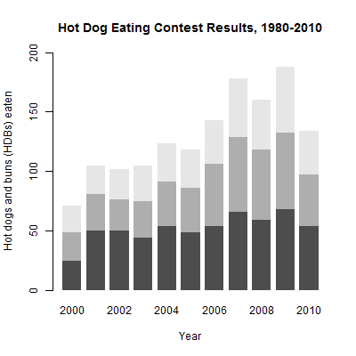
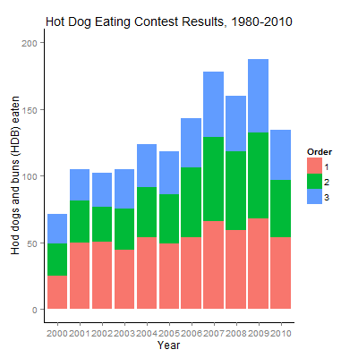

# 第4章笔记 Stacked Bar Chart (hot-dog-places)

**目录**

## 代码
 - 数据，[hot-dog-places.csv](hot-dog-places.csv)
 - 课本代码，[book.R](book.R)
 - 改编代码，[mine.R](mine.R)

## 课本内容简介

 - 使用barplot来绘制stacked bar chart，画出每年前3名吃的个数

课本代码 barplot | 改编代码 ggplot2
--------|--------
|

## 笔记 - 去除data.frame的header中讨厌的“首字母X”

如果csv文件的header是数字，
```
$ cat hot-dog-places.csv
2000,2001,2002,2003,2004,2005,2006,2007,2008,2009,2010
25,50,50.5,44.5,53.5,49,54,66,59,68,54
24,31,26,30.5,38,37,52,63,59,64.5,43
22,23.5,25.5,29.5,32,32,37,49,42,55,37
```

read.csv会自动为header添加首字母X。例如，把“2000”变成“X2000”
```
> hot_dog_places <- read.csv("hot-dog-places.csv", sep=",", header=TRUE)
> hot_dog_places
  X2000 X2001 X2002 X2003 X2004 X2005 X2006 X2007 X2008 X2009 X2010
1    25  50.0  50.5  44.5  53.5    49    54    66    59  68.0    54
2    24  31.0  26.0  30.5  38.0    37    52    63    59  64.5    43
3    22  23.5  25.5  29.5  32.0    32    37    49    42  55.0    37
```

为了绘图时X坐标值显示“2000”而不是“X2000”
 - 课本使用简单的手工方法

```R
    names(hot_dog_places) <- c("2000", "2001", "2002", "2003", "2004",
      "2005", "2006", "2007", "2008", "2009", "2010")
```

 - 改编代码方法1，使用sub()把“X”替换成空串

```R
    # option 1: replace "X" with ""
    names(hot_dog_places) <- sub("X", "", names(hot_dog_places))
```

 - 改编代码方法2，使用paste()来快速生成字符串向量

```R
    # option 2: assign generated string names from numeric
    names(hot_dog_places) <- c(paste("200", 0:9, sep = ""), "2010")
```

## 笔记 - 用ggplot2替代barplot画stacked bar chart

 - 课本代码先生成matrix，然后使用barplot

```
> hot_dog_matrix <- as.matrix(hot_dog_places)
> hot_dog_matrix
     2000 2001 2002 2003 2004 2005 2006 2007 2008 2009 2010
[1,]   25 50.0 50.5 44.5 53.5   49   54   66   59 68.0   54
[2,]   24 31.0 26.0 30.5 38.0   37   52   63   59 64.5   43
[3,]   22 23.5 25.5 29.5 32.0   32   37   49   42 55.0   37
```

```R
    barplot(hot_dog_matrix, border=NA, space=0.25, ylim=c(0, 200),
      xlab="Year", ylab="Hot dogs and buns (HDBs) eaten",
      main="Hot Dog Eating Contest Results, 1980-2010")
```

 - 改编代码先生成data frame

```R
    # tranform places into data frame friendly to ggplot
    Count <- c(hot_dog_matrix)
    Place <- gl(3, 1, 3*11)
    ns <- names(hot_dog_places)
    Year <- sort(rep(ns, 3))
    data <- data.frame(Year, Place, Count)
```

每条语句效果

```
TODO
```

 - 改编代码然后使用ggplot2

```R
    p <- ggplot(data, aes(x=Year, y=Count, fill=Place))
    p <- p + geom_bar(stat="identity")

    # title
    p <- p + ggtitle("Hot Dog Eating Contest Results, 1980-2010")

    # NO need to assign X axis label for default is same as variable name
    # assign Y axis label  
    p <- p + ylab("Hod dogs and buns (HDB) eaten")

    # y limit
    p <- p + ylim(0, 200)

    # tune panel and axis color
    p <- p + theme(panel.border = element_blank(),
        panel.grid = element_blank(), panel.background = element_blank(),
        axis.line = element_line(colour="black"))
    p
```
