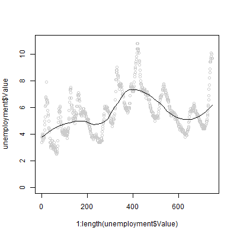
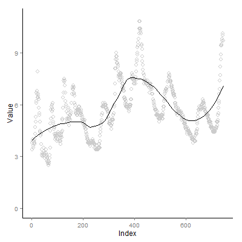

# 第4章笔记 LOESS Fit Chart (unemployment-rate-1948-2010)

**目录**
 - [代码](#%E4%BB%A3%E7%A0%81)
 - [课本内容简介](#%E8%AF%BE%E6%9C%AC%E5%86%85%E5%AE%B9%E7%AE%80%E4%BB%8B)
 - [笔记 - 用ggplot2替代plot+scatter.smooth画基于LOESS的拟合曲线](#%E7%AC%94%E8%AE%B0---%E7%94%A8ggplot2%E6%9B%BF%E4%BB%A3plotscattersmooth%E7%94%BB%E5%9F%BA%E4%BA%8Eloess%E7%9A%84%E6%8B%9F%E5%90%88%E6%9B%B2%E7%BA%BF)

## 代码
 - 数据，[unemployment-rate-1948-2010.csv](unemployment-rate-1948-2010.csv)
 - 课本代码，[book.R](book.R)
 - 改编代码，[mine.R](mine.R)

## 课本内容简介
 - 绘制历年失业率Scatter Point Chart并且画基于LOESS的拟合曲线

课本代码 | 改编代码
---------|---------
 | 

## 笔记 - 用ggplot2替代plot+scatter.smooth画基于LOESS的拟合曲线

课本代码

```R
    # Plain scatter plot
    plot(1:length(unemployment$Value), unemployment$Value)

    scatter.smooth(x=1:length(unemployment$Value),
      y=unemployment$Value, ylim=c(0,11), degree=2, col="#CCCCCC", span=0.5)
```

改编代码
 - geom_point(size = 3, shape = 21, color = "#CCCCCC")，画Scatter Point Chart，并设置点圆点颜色
 - stat_smooth(se = FALSE, color = "black", method = "loess", degree = 2, span = 0.5)，画基于LOESS的拟合曲线
   - se = FALSE，不要画Confidence Interval
   - method = "loess", degree = 2, span = 0.5，显示使用LOESS，并设置相关参数

```R
    p <- ggplot(unemployment, aes(x=1:length(Value), y=Value))

    # shape #21 is hollow circle
    p <- p + geom_point(size = 3, shape = 21, color = "#CCCCCC")

    # se = FALSE hides confidence interval
    p <- p + stat_smooth(se = FALSE, color = "black", method = "loess", degree = 2, span = 0.5)

    # y limit
    p <- p + ylim(0, 11)

    # x label
    p <- p + xlab("Index")

    # tune panel and axis color
    p <- p + theme(panel.border = element_blank(),
        panel.grid = element_blank(), panel.background = element_blank(),
        axis.line = element_line(colour="black"))
    p
```
