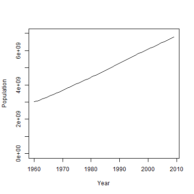
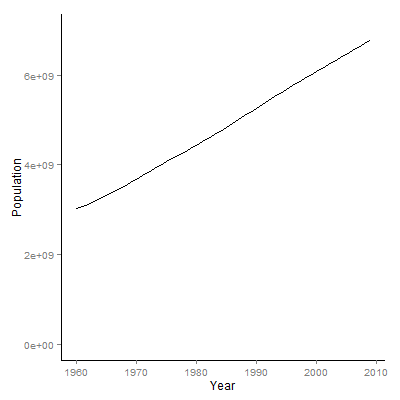

# 第4章笔记 Line Chart (world-population)

**目录**

## 代码
 - 数据，[world-population.csv](world-population.csv)
 - 课本代码，[book.R](book.R)
 - 改编代码，[mine.R](mine.R)

## 课本内容简介

 - 使用plot(type="l")绘制人口历年走势

课本代码 plot(type="l") | 改编代码 ggplot2
--------|--------
|

## 笔记 - 用ggplot2替代plot(type="l")画line chart

 - 课本代码使用plot(type="l")

```R
    plot(population$Year, population$Population, type="l",
      ylim=c(0, 7000000000), xlab="Year", ylab="Population")
```
 
 - 改编代码使用ggplot2

```R
    p <- ggplot(population, aes(x=Year, y=Population))
    p <- p + geom_line()

    # y limit
    p <- p + ylim(0, 7000000000)

    # tune panel and axis color
    p <- p + theme(panel.border = element_blank(),
        panel.grid = element_blank(), panel.background = element_blank(),
        axis.line = element_line(colour="black"))
    p
```
